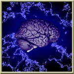

# Braynzarsoft DirectX Tutorial Collection
 
Collection of tutorials from Braynzarsoft.net's DirectX11 Collection of tutorials with replaced depreciated code. All code featured in 
this  repository and from the DirectX tutorial collections on the website is free to use.
# Visit Braynzarsoft.net
[Home](https://www.braynzarsoft.net) 
[DirectX9 Tutorial Collection](https://www.braynzarsoft.net/viewtutorial/q16390-directx-9-braynzar-soft-tutorials) 
[DirectX10 Tutorial Collection]() 
[DirectX11 Tutorial Collection](https://www.braynzarsoft.net/viewtutorial/q16390-braynzar-soft-directx-11-tutorials) 
[DirectX12 Tutorial Collection]() 

<!--# Working DirectX9 Tutorials Status
| Tutorial Number | Status |
| ------------ | ------------ |

# Working DirectX10 Tutorials Status
| Tutorial Number | Status |
| ------------ | ------------ |-->

# Working DirectX11 Tutorials Status
| Tutorial Number | Status |
| ------------ | ------------ |
| 01 - Setting Up | 
NOT DONE
 |
| 02 - An Introduction to the Win32 API | 
NOT DONE
 |
| 03 - Initializing Direct3D 11 | 
NOT DONE
 |
| 04 - Begin Drawing | 
NOT DONE
 |
| 05 - Color | 
NOT DONE
 |
| 06 - Indices | 
NOT DONE
 |
| 07 - Depth | 
NOT DONE
 |
| 08 - World View and Local Spaces | 
NOT DONE
 |
| 09 - Transformations | 
NOT DONE
 |
| 10 - Render States | 
NOT DONE
 |
| 11 - Textures | 
NOT DONE
 |
| 12 - Blending | 
NOT DONE
 |
| 13 - Pixel Clipping | 
NOT DONE
 |
| 14 - Simple Font | 
NOT DONE
 |
| 15 - High Resolution Timer | 
NOT DONE
 |
| 16 - Simple Lighting | 
NOT DONE
 |
| 17 - Point Lights | 
NOT DONE
 |
| 18 - Direct Input | 
NOT DONE
 |
| 19 - First Person Camera | 
NOT DONE
 | 
| 20 - Cube Mapping | 
NOT DONE
 | 
| 21 - Spotlights | 
NOT DONE
 | 
| 22 - Loading Static 3D Models | 
NOT DONE
 | 
| 23 - Normal Mapping | 
NOT DONE
 | 
| 24 - Picking | 
NOT DONE
 | 
| 25 - Bounding Volumes | 
NOT DONE
 | 
| 26 - Bounding Volume Collision Detection | 
NOT DONE
 | 
| 27 - Loading An MD5 Model | 
NOT DONE
 | 
| 28 - Skeletal Animation | 
NOT DONE
 | 
| 29 - Freelook Camera | 
NOT DONE
 | 
| 30 - Heightmap | 
NOT DONE
 | 
| 31 - Sliding Camera Collision Detection | 
NOT DONE
 | 
| 32 - Simple 3rd Person Camera | 
NOT DONE
 | 
| 33 - Instancing | 
NOT DONE
 | 
| 34 - AABB CPU Side Frustum Culling | 
NOT DONE
 | 
| 35 - Render to Texture | 
NOT DONE
 | 
| 36 - Billboarding | 
NOT DONE
 | 
| 37 - Constant Buffer Packaging | 
NOT DONE
 | 

<!--# Working DirectX12 Tutorials Status
| Tutorial Number | Status |
| ------------ | ------------ |-->

<head>
  
<head>